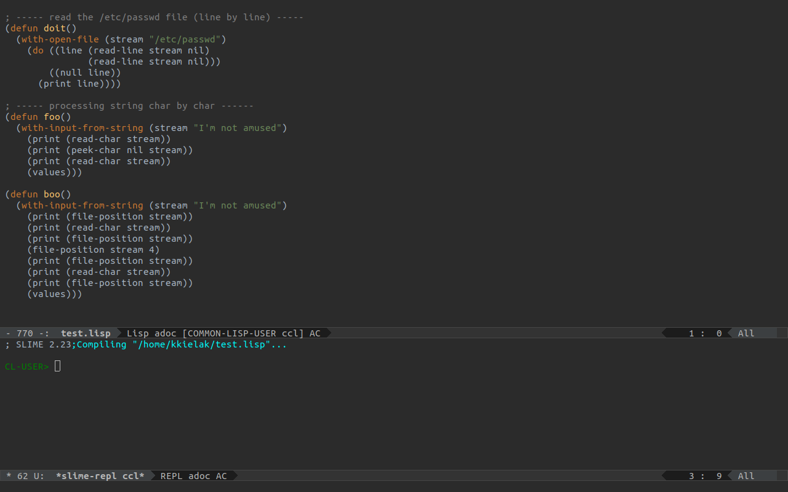

# emacs-config
My emacs configuration

Following `.git` directories has been removed from sub repositories with the following commands:

    $ find . -mindepth 2 -type d -name .git -print0 | xargs -n1 -0 echo
    ./.emacs.d/powerline/.git
    ./.emacs.d/themes/idea-darkula-theme/.git
    ./.emacs.d/themes/tao-theme-emacs/.git
    ./.emacs.d/themes/foggy-night-theme/.git
    ./.emacs.d/multiple-cursors.el/.git
    ./.emacs.d/emacs-jedi/.git

    $ find . -mindepth 2 -type d -name .git -print0 | xargs -n1 -0 rm

## Installation

After clonig the repo, copy `.emacs` and `.emacs.d/` to `$HOME` folder.

## SLIME via Quicklisp

I'd advise to install SLIME through quicklisp-slime-helper

You would need to install some Lisp you like (let it be CCL for this purpose, as described above), then, in the same shell do this:

(Suppose you are on a Debian-like Linux)

    $ sudo apt-get install wget
    $ cd ~/Downloads
    $ wget http://beta.quicklisp.org/quicklisp.lisp
    $ lx86cl64 --load ./quicklisp.lisp

wait until you see Lisp shell prompt,

    * (quicklisp-quickstart:install)
    * (ql:add-to-init-file)
    * (ql:quickload "quicklisp-slime-helper")
    * (quit)

now you are back in the regular shell. Launch Emacs, if not open yet. C-f x~/.emacs. Add the lines below to it (instead of what you posted above):

    ;; SLIME setup for CCL
    (load (expand-file-name "~/quicklisp/slime-helper.el"))
    (setq inferior-lisp-program "~/opt/ccl/lx86cl64")
    (slime-setup '(slime-fancy))

## HyperSpec in Emacs via w3m

Following commands in the .emacs files will configure HyperSpec lookup for symbol under a cursor, by using w3m browser within Emacs.

    ;; Hyperspec
    (global-set-key [(f2)] 'slime-hyperspec-lookup) 
    (setq common-lisp-hyperspec-root (expand-file-name "~/.emacs.d/HyperSpec/"))

    (require 'w3m)
    (setq browse-url-browser-function 'w3m-browse-url)
    (autoload 'w3m-browse-url "w3m" "Ask a WWW browser to show a URL." t)
     ;; optional keyboard short-cut
    (global-set-key "\C-xm" 'browse-url-at-point)

## Setting up w3m

In order to use w3m from Emacs, you need to install w3m tool from the OS level. In case of Ubuntu/Debian:

    $ sudo apt install w3m

## HyperSpec installation

Current version of the Lisp Hyperspec can be downloaded from LispWorks' website with following command:

    $ curl -O http://ftp.lispworks.com/pub/software_tools/reference/HyperSpec-7-0.tar.gz

After download, files should be extracted to `~/.emacs.d/HyperSpec` folder to match SLIME configuration related to HyperSpec location that we have set up in previous steps. 

> Note: please check following legal stuff before downloading HyperSpec from LispWorks: [http://www.lispworks.com/documentation/HyperSpec/Front/Help.htm#Legal]
